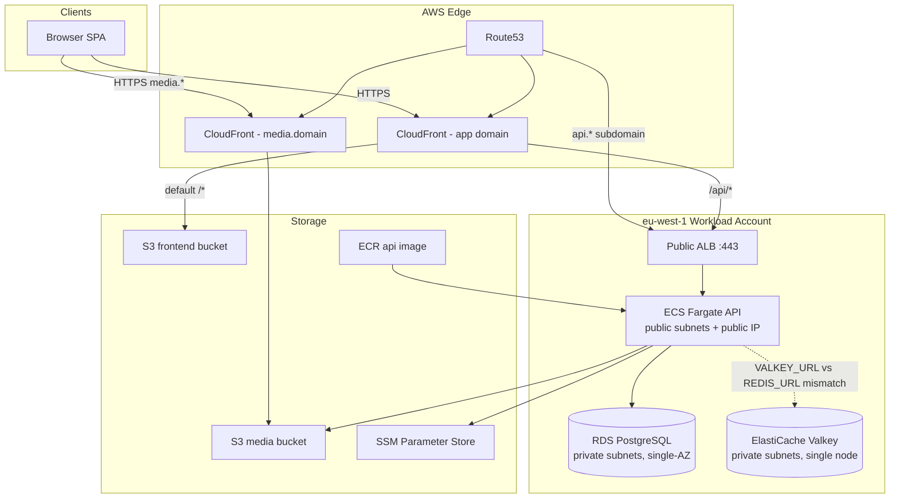

# RentDirect Architectural Review and Recommendations

Reviewed on: 2026-05-30

## Scope

This document captures an architectural review of the RentDirect repository against industry best practices for:

1. Security
2. Cost
3. Performance
4. Lowest latency
5. Fault tolerance
6. High availability

Reviewed areas include:

- `apps/api/` — Django REST Framework backend
- `apps/web/` — Vite + React frontend
- `apps/worker/` — background job placeholder
- `packages/` — shared package placeholders
- `infra/terraform/` — AWS infrastructure (ECS, RDS, Valkey, S3, CloudFront, ALB)
- `infra/scripts/` — deploy, bootstrap, and migration scripts
- `docker-compose.yml` — local development stack
- `docs/cloud_deployment_cost_estimate.md` — existing cost analysis

These are planning recommendations, not a commitment to implement every item. Priorities are grouped by impact and maturity stage at the end of this document.

---

## Current Architecture

RentDirect is a rental marketplace monorepo deployed on AWS in `eu-west-1`:

| Layer | Technology |
|-------|------------|
| Frontend | Vite 5 + React 18 + TypeScript + Tailwind, static build on S3 |
| API | Django 5.1 + DRF + JWT cookies, Gunicorn on ECS Fargate (ARM64) |
| Database | RDS PostgreSQL 18.1 (gp3, encrypted, private subnets) |
| Cache | ElastiCache Valkey (`cache.t4g.micro`) |
| Storage | S3 (frontend + media buckets), CloudFront OAC |
| Edge | CloudFront (app + media distributions), Route53, ACM |
| Load balancing | Public ALB (TLS 1.3) |
| Secrets | SSM Parameter Store + age-encrypted local env files |
| IaC | Terraform workspaces (`dev` / `prod`) |
| CI/CD | Manual scripts (`make deploy`); no GitHub Actions workflows yet |

### Traffic flow

```text
Browser
  ├─ HTTPS → CloudFront (rentdirect.homes) → S3 frontend bucket
  ├─ HTTPS → CloudFront (/api/*) → ALB → ECS Fargate :8000
  ├─ HTTPS → api.rentdirect.homes → ALB → ECS Fargate :8000
  └─ HTTPS → media.rentdirect.homes → CloudFront → S3 media bucket

ECS Fargate
  ├─ RDS PostgreSQL (private subnets, SSL required)
  ├─ ElastiCache Valkey (private subnets)
  └─ S3 media bucket (upload via django-storages)
```

### Architecture diagram



### Environment sizing (prod)

| Component | Configuration |
|-----------|---------------|
| ECS | 512 CPU / 1024 MB, 1–4 tasks, CPU autoscaling at 65% |
| RDS | `db.t4g.small`, 20 GB gp3, 7-day backups, `multi_az = false` |
| Valkey | `cache.t4g.micro`, engine 7.1, `replica_count = 0` |
| CloudFront | PriceClass_100, HTTP/2 + HTTP/3 |
| Container Insights | Disabled |

---

## Executive Summary

| Dimension | Current grade | Top priority action |
|-----------|---------------|---------------------|
| **Security** | B− | Add WAF + rate limiting; move ECS to private subnets |
| **Cost** | B+ | Fix `REDIS_URL` / `VALKEY_URL` mismatch (stop paying for unused cache) |
| **Performance** | C+ | Wire Valkey; add DRF throttling and query tuning |
| **Latency** | B | Keep CDN for static/media; standardize on direct API subdomain |
| **Fault tolerance** | C | Multi-AZ RDS, 2+ ECS tasks, cache replica |
| **High availability** | C+ | Raise prod `min_count` to 2; enable RDS Multi-AZ |

**Bottom line:** RentDirect makes smart, cost-conscious choices for an MVP. The foundation is solid for early production, but the stack is not yet hardened for HA or security at scale. The single highest-impact fix is wiring Valkey correctly — it improves security (rate limiting), performance (shared cache), cost (stop paying for unused infra), and fault tolerance (externalized state) in one change.

---

## 1. Security

### What is already good

- **Authentication:** JWT in HttpOnly cookies (`CookieJWTAuthentication`), role-based permissions, OTP registration with attempt limits.
- **Transport and headers:** TLS 1.3 on ALB, HSTS, secure cookies, `X_FRAME_OPTIONS=DENY`, referrer policy in production settings.
- **Secrets management:** SSM SecureString for DB password and Django secret; age-encrypted local env files for Terraform.
- **Network isolation:** RDS and Valkey in private subnets; security groups restrict DB/cache access to ECS only.
- **Storage:** S3 public access blocked; CloudFront Origin Access Control (OAC); SSE on buckets; DB encryption at rest and SSL required in prod.
- **Application defaults:** DRF default permission is `IsAuthenticated`; upload size cap; contact-info filtering in messages.

### Gaps and risks

| Issue | Severity | Detail |
|-------|----------|--------|
| **No WAF** | High | ALB and CloudFront have no AWS WAF — exposed to SQLi, bot abuse, credential stuffing. |
| **ECS in public subnets** | Medium | Tasks use `assign_public_ip = true` to avoid NAT cost; increases attack surface vs private subnets + NAT or VPC endpoints. |
| **Valkey transit encryption off** | Medium | `transit_encryption_enabled = false` in Terraform — cache traffic is plaintext inside VPC. |
| **Rate limiting not implemented** | Medium | `django-ratelimit` is in `requirements.txt` but unused; auth/OTP/webhook endpoints are unprotected at the edge. |
| **Payment webhook is open** | Medium | Flutterwave webhook uses `AllowAny`; signature verification must be enforced in production. |
| **Unsigned media URLs** | Low–Medium | `querystring_auth: false` — fine for public listing photos; risky if sensitive docs share the bucket. |
| **ALB HTTP listener** | Low | Port 80 forwards to targets instead of redirecting to HTTPS (CloudFront handles redirect for app domain; direct `api.*` hits may not). |
| **`makemigrations` on startup** | Low | Dev entrypoint runs `makemigrations` — dangerous if ever enabled in prod. |
| **Hardcoded `COOKIE_DOMAIN`** | Low | `.rentdirect.homes` in Terraform locals breaks cookie domain for dev subdomain testing. |
| **No CI security gates** | Medium | No automated SAST, dependency scanning, or secret scanning in `.github/`. |

### Evidence in codebase

Terraform sets `VALKEY_URL` in `infra/terraform/locals.tf`, but Django reads `REDIS_URL`:

```python
# apps/api/config/settings.py
CACHES = {
    "default": {
        "BACKEND": "django_redis.cache.RedisCache" if os.environ.get("REDIS_URL") else "django.core.cache.backends.locmem.LocMemCache",
        "LOCATION": os.environ.get("REDIS_URL", "rentdirect-local"),
        ...
    }
}
```

ECS tasks run in public subnets with public IPs:

```hcl
# infra/terraform/modules/ecs_service/services.tf
network_configuration {
  subnets          = var.public_subnet_ids
  security_groups  = [var.app_security_group_id]
  assign_public_ip = true
}
```

Valkey transit encryption is disabled:

```hcl
# infra/terraform/modules/databases/elasticache.tf
transit_encryption_enabled = false
```

### Recommendations (priority order)

1. **Add AWS WAF** on CloudFront (frontend) and ALB (API): AWS Managed Rules (Core, Known Bad Inputs, IP Reputation), rate-based rules on `/api/v1/auth/*` and webhooks.
2. **Implement rate limiting:** DRF throttling classes globally plus `@ratelimit` on login, register, OTP, and webhook endpoints.
3. **Move ECS to private subnets** with either:
   - Single NAT Gateway (~$32/mo) + VPC endpoints for ECR, SSM, CloudWatch, S3, or
   - VPC endpoints only (no NAT) if outbound traffic is limited to AWS services.
4. **Enable Valkey transit encryption** and use `rediss://` in Django.
5. **Enforce webhook signature verification** — reject requests when secret is missing in prod.
6. **Separate sensitive uploads** (ID docs, deeds) into a private prefix/bucket with signed CloudFront URLs or S3 presigned URLs.
7. **Add GitHub Actions:** `bandit`, `pip-audit`, `npm audit`, Terraform `checkov`/`tfsec`, and OIDC-based AWS deploy (no long-lived keys).
8. **Remove `makemigrations` from entrypoint**; migrations only via dedicated ECS task (already partially done for prod).

---

## 2. Cost

### What is already good

Documented in `docs/cloud_deployment_cost_estimate.md` — deliberate tradeoffs:

- **No NAT gateways** — saves ~$32+/month per gateway.
- **Graviton everywhere** — Fargate ARM64, `db.t4g.*`, `cache.t4g.micro`.
- **Minimal sizing** — prod ~512 CPU / 1 GB, 1 baseline task.
- **PriceClass_100** CloudFront — EU-focused, cheaper than global.
- **Container Insights disabled** — saves CloudWatch costs at launch.
- **Separate S3 buckets** — avoids risky `sync --delete` on user media (good ops choice, indirect cost saver).

Baseline prod is roughly **~$150/month AWS** — appropriate for an MVP.

### Gaps and waste

| Issue | Monthly impact | Detail |
|-------|----------------|--------|
| **Valkey unused in prod** | ~$12–15 wasted | Terraform sets `VALKEY_URL`; Django reads `REDIS_URL` → LocMemCache in every task. |
| **Dev always-on** | ~$87/month | Cost doc recommends scheduling; not automated. |
| **Public IPv4 on Fargate** | ~$3–4/task | AWS charges for public IPv4; private tasks + NAT or endpoints trade off differently. |
| **Dual API routing** | Minor CF cost | `/api/*` via CloudFront + direct `api.*` subdomain — extra origin complexity, small CF request charges. |
| **No Reserved Capacity** | Future | At steady state, 1-year RDS/Fargate Savings Plans can cut 20–40%. |

### Recommendations

1. **Fix cache env var immediately** — set `REDIS_URL` from Valkey endpoint in Terraform (or teach Django to accept `VALKEY_URL`). This is pure waste today.
2. **Schedule dev environment** — EventBridge + Lambda to scale ECS to 0 and stop RDS off-hours (nights/weekends); saves ~40–60% on dev.
3. **Disable Valkey in dev** until needed — or use a single shared dev cache; `cache.t4g.micro` × 2 envs adds up.
4. **Keep NAT-less design for now** — cost-optimal at current scale; revisit when compliance or attack surface requires private egress.
5. **Use S3 Intelligent-Tiering** for media after ~6 months of growth.
6. **Set CloudWatch log retention** — 30 days is fine; add metric filters only for errors, not full request logging.
7. **At growth:** Savings Plans for Fargate, RDS Reserved Instances, and consider Aurora Serverless v2 only if auto-scaling DB is needed (usually overkill before ~10k DAU).

---

## 3. Performance

### What is already good

- CloudFront with **CachingOptimized** policy for static assets and media.
- **Gunicorn** 2 workers × 4 threads per task.
- **DB connection pooling** via `DB_CONN_MAX_AGE=600`.
- **gp3** storage with autoscaling cap (20 → 100 GB).
- **CPU-based autoscaling** (65% target, up to 4 tasks in prod).
- **DRF pagination** (page size 20) limits payload size.
- **Frontend:** Vite code-splitting, TanStack Query for client-side caching.

### Gaps

| Issue | Impact |
|-------|--------|
| **LocMemCache in prod** | No shared cache across tasks; OTP/session/throttle state inconsistent; repeated DB hits. |
| **CPU-only autoscaling** | Memory-bound workloads (image processing, large JSON) will not scale correctly. |
| **No Performance Insights** | Hard to diagnose slow queries. |
| **No read replicas** | All reads hit primary RDS. |
| **No background worker** | Email, image processing, webhooks block request threads. |
| **No CDN cache headers tuning** | Media uses optimized policy; verify `Cache-Control` on upload. |

### Recommendations

1. **Wire Valkey** for: Django cache, session store (if needed), OTP rate limits, listing search result caching, DRF throttling backend.
2. **Add composite DB indexes** on hot paths: `(city, status)`, `(landlord_id, created_at)`, booking date ranges — profile with `EXPLAIN ANALYZE` in staging.
3. **Enable RDS Performance Insights** (free tier: 7 days retention) before prod traffic grows.
4. **Add memory-based autoscaling** alongside CPU (ALB `TargetResponseTime` or custom CloudWatch metric).
5. **Implement `apps/worker`** (Celery/RQ + same Valkey) for email, image thumbnailing, payment reconciliation.
6. **Use `select_related` / `prefetch_related`** on listing and booking list endpoints (audit viewsets).
7. **Avoid ALB stickiness as a cache workaround** — fix shared cache instead of relying on per-task LocMemCache.

---

## 4. Lowest Latency

### What is already good

- **CloudFront edge** for frontend and media — users get static assets from nearest PoP.
- **HTTP/2 and HTTP/3** on CloudFront distributions.
- **Compression enabled** on CloudFront behaviors.
- **Direct API subdomain** (`api.rentdirect.homes` → ALB) avoids an extra CloudFront hop for API calls when configured that way.

### Architecture note

The SPA can call the API via two paths:

- `https://api.rentdirect.homes` → Route53 → ALB (1 hop after DNS)
- `https://rentdirect.homes/api/*` → CloudFront → ALB (extra edge hop, caching disabled)

For **lowest API latency**, industry standard is: **direct regional API subdomain**, CloudFront only for cacheable assets.

### Gaps

| Issue | Latency impact |
|-------|----------------|
| **Single region (`eu-west-1`)** | Nigeria/EU users OK; US/Asia see ~100–200ms RTT to API. |
| **No edge TLS for API subdomain** | Minor — TLS handshake at ALB in Ireland vs edge. |
| **No connection keep-alive tuning** | ALB idle timeout 60s is fine; verify gunicorn keepalive. |
| **Cold starts on scale-from-1** | First request after idle scale-up adds ~10–30s container start. |

### Recommendations

1. **Standardize on `api.rentdirect.homes`** in frontend build (`VITE_API_URL`) — drop `/api/*` CloudFront proxy unless same-origin cookies are required (`.rentdirect.homes` cookie domain makes subdomain viable).
2. **Keep media on `media.rentdirect.homes`** — long TTL at edge; set `Cache-Control: public, max-age=31536000, immutable` on hashed listing images.
3. **Optional: CloudFront in front of API subdomain** with caching disabled — shaves TLS RTT for distant users; only worth it if analytics show high non-EU traffic.
4. **Set `min_count = 2` in prod** — eliminates cold-start latency during deployments and AZ failures.
5. **If Nigeria is primary market:** consider `af-south-1` (Cape Town) as primary region — lower RTT for Flutterwave and local users; higher AWS cost and fewer services.
6. **Enable RDS Proxy** only when connection churn from many Fargate tasks becomes an issue (typically >20 tasks).

---

## 5. Fault Tolerance

### What is already good

- **ECS deployment circuit breaker** with automatic rollback.
- **Multi-layer health checks:** container, ALB (`/api/health/ready`), Django DB probe.
- **RDS automated backups** (7 days prod, 1 day dev).
- **S3 versioning** on buckets.
- **Separate migration ECS task** — schema changes do not run inside serving containers (prod).
- **Deletion protection** on prod RDS and ALB.

### Gaps

| Component | Single point of failure? |
|-----------|--------------------------|
| RDS (`multi_az = false`) | **Yes** — AZ outage = downtime until failover/manual recovery. |
| Valkey (`replica_count = 0`) | **Yes** — cache loss on node failure. |
| ECS (`desired_count = 1`) | **Yes** — task crash = outage until scheduler replaces it. |
| No worker queue | **Yes** — failed email/payment processing is lost. |
| Single region | **Yes** — regional AWS outage = full outage. |
| Manual deploys | **Risk** — human error during deploys. |

### Recommendations by maturity stage

**Launch (minimal cost increase, ~+$25–40/mo):**

1. **`min_count = 2`** for prod ECS — tasks spread across AZs by default.
2. **Fix Valkey wiring** — cache survives restarts; enables shared rate-limit state.
3. **Automated backups tested** — quarterly restore drill to staging RDS.

**Growth (~+$50–80/mo):**

1. **RDS Multi-AZ** — synchronous standby, automatic failover (~60–120s).
2. **Valkey replica + `automatic_failover_enabled`** — set `replica_count = 1`.
3. **Dead-letter queue** for background jobs when worker is added.
4. **S3 cross-region replication** for media (optional DR).

**Scale:**

1. **Multi-region active-passive** — Route53 health checks + standby stack (usually unnecessary before significant revenue).

---

## 6. High Availability

### Current HA posture

| Layer | HA status |
|-------|-----------|
| ALB | Multi-AZ ✓ |
| ECS | Can run in 2 AZs, but **only 1 task** configured |
| RDS | Single-AZ ✗ |
| Valkey | Single node ✗ |
| CloudFront | Global, highly available ✓ |
| S3 | 99.999999999% durability ✓ |
| Route53 | Global ✓ |

**Effective availability:** roughly **99.5%** (single-AZ RDS + single task) vs **99.9%+** target for a paid marketplace.

### Recommendations

1. **Prod ECS:** `desired_count = 2`, `min_count = 2`, `max_count = 4` — ensures AZ-level redundancy at the compute layer.
2. **RDS Multi-AZ** for prod — industry standard for production databases; accept ~2× RDS instance cost for the standby.
3. **ElastiCache Multi-AZ with replica** — when cache holds session/throttle state (after Valkey fix).
4. **ALB cross-zone load balancing** — enabled by default; verify target group has healthy targets in both AZs.
5. **Health check tuning:** reduce `interval` to 15s and `healthy_threshold` to 2 for faster recovery (trade-off: more health check traffic).
6. **Runbook + monitoring:**
   - CloudWatch alarms: ALB 5xx, ECS running count < desired, RDS CPU/storage, Valkey evictions.
   - SNS → email/Slack/PagerDuty.
7. **CI/CD pipeline** with blue/green or rolling deploy — ECS circuit breaker helps, but automated rollback on failed health checks is stronger with CodeDeploy or GitHub Actions smoke tests post-deploy.

---

## Cross-Cutting: Operational Maturity

These gaps affect all six dimensions:

| Gap | Recommendation |
|-----|----------------|
| No GitHub Actions | Add: test → build → push ECR → migrate → deploy ECS → S3 sync → CF invalidation |
| Terraform `local-exec` bootstrap | Move image build/push to CI; keep Terraform declarative |
| Placeholder worker/K8s/packages | Fine for MVP; implement worker before payments go live |
| Dev/prod Valkey version mismatch (7.1 vs 9.0) | Align versions to reduce surprises |
| Commented Terraform outputs | Restore outputs for ARNs, URLs — reduces operator errors |
| Featured payments mocked | Keep the live Flutterwave flow covered by integration tests before monetization |
| NIN verification format-only | Integrate external KYC API when compliance requires it |
| CloudFront `/ws/*` behavior | Remove or implement WebSocket support (no Channels app today) |
| App SG port 3200 | Remove unused ingress rule (likely copy-paste leftover) |

---

## Known Issues Register

| ID | Issue | Affected dimensions | Fix |
|----|-------|---------------------|-----|
| KI-01 | `VALKEY_URL` set in Terraform, Django reads `REDIS_URL` | Cost, Performance, Security, HA | Set `REDIS_URL` in Terraform or update Django settings |
| KI-02 | No WAF on ALB/CloudFront | Security | Add AWS WAF managed rule sets |
| KI-03 | ECS tasks in public subnets | Security, Cost | Move to private subnets + NAT or VPC endpoints |
| KI-04 | RDS single-AZ in prod | Fault tolerance, HA | Enable `multi_az = true` |
| KI-05 | Prod ECS `desired_count = 1` | Fault tolerance, HA, Latency | Set `min_count = 2` |
| KI-06 | Valkey single node, no transit encryption | Security, Fault tolerance | Add replica; enable transit encryption |
| KI-07 | `django-ratelimit` unused | Security, Performance | Implement DRF throttling + decorators |
| KI-08 | No CI/CD pipeline | Security, Fault tolerance | Add GitHub Actions with OIDC |
| KI-09 | Flutterwave webhook `AllowAny` | Security | Enforce signature verification in prod |
| KI-10 | `makemigrations` in entrypoint (dev) | Security, Fault tolerance | Remove; use migration task only |

---

## Recommended Roadmap

### Phase 0 — Immediate (low cost, high impact)

1. Fix `REDIS_URL` / `VALKEY_URL` mismatch.
2. Add DRF throttling + basic WAF rate rules on auth endpoints.
3. Set prod `min_count = 2`.
4. Remove `makemigrations` from entrypoint.

### Phase 1 — Pre-launch (security + ops)

1. GitHub Actions CI/CD with OIDC.
2. AWS WAF managed rule sets on ALB + CloudFront.
3. Enforce Flutterwave webhook signature in prod.
4. CloudWatch alarms + runbook.

### Phase 2 — Post-traction (HA + performance)

1. RDS Multi-AZ.
2. Valkey replica with transit encryption.
3. ECS in private subnets + VPC endpoints.
4. Background worker for email and payments.

### Phase 3 — Scale

1. Performance Insights + query optimization.
2. Savings Plans / Reserved Instances.
3. Regional expansion if user base warrants it.

---

## Related Documents

- [Cloud Deployment Cost Estimate](./cloud_deployment_cost_estimate.md) — monthly cost breakdown and sizing rationale
- [README](../README.md) — local development and production shape overview
- [Terraform README](../infra/terraform/README.md) — infrastructure deployment guide

---

## Appendix: Key File References

| Area | Path |
|------|------|
| Django settings | `apps/api/config/settings.py` |
| Auth | `apps/api/core/authentication.py` |
| Health check | `apps/api/core/middleware.py` |
| API views / webhooks | `apps/api/core/views.py` |
| Docker Compose (local) | `docker-compose.yml` |
| API Dockerfile | `apps/api/Dockerfile` |
| Entrypoint | `apps/api/docker-entrypoint.sh` |
| Terraform root | `infra/terraform/main.tf` |
| ECS task/service | `infra/terraform/modules/ecs_service/` |
| RDS | `infra/terraform/modules/databases/rds.tf` |
| Valkey | `infra/terraform/modules/databases/elasticache.tf` |
| CloudFront | `infra/terraform/modules/networking/cloudfront.tf` |
| ALB | `infra/terraform/modules/networking/alb.tf` |
| Prod sizing | `infra/terraform/envs/prod.tfvars` |
| Dev sizing | `infra/terraform/envs/dev.tfvars` |
| Deploy scripts | `infra/scripts/deploy/` |
